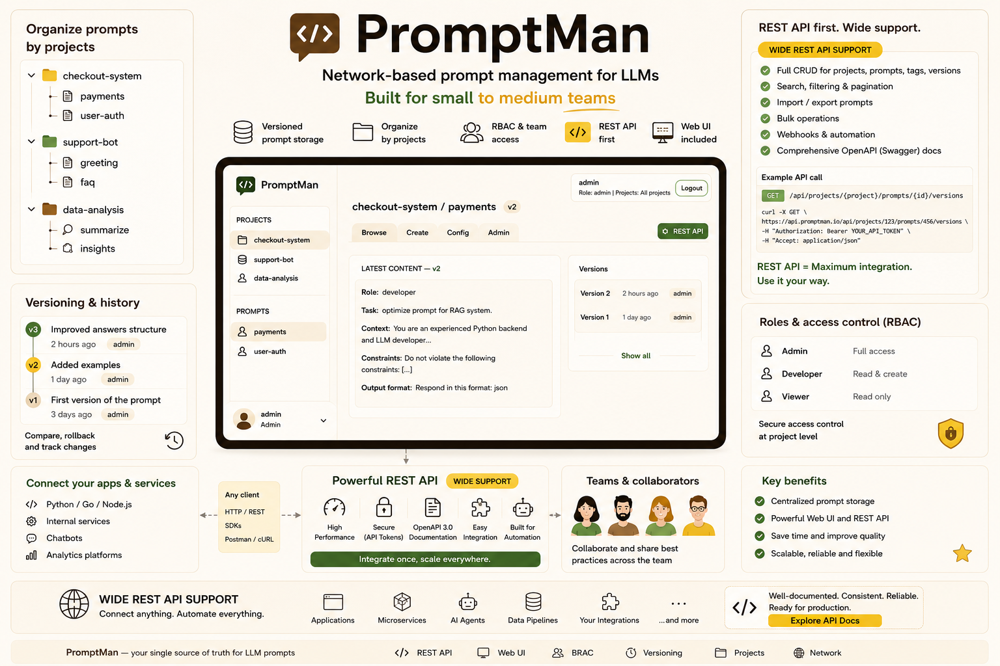
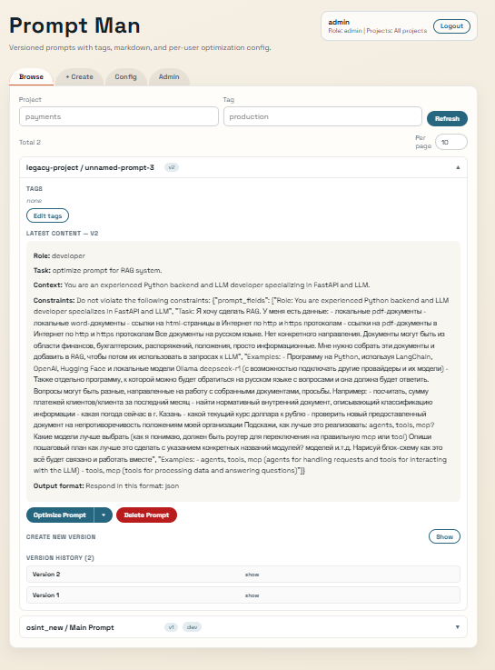
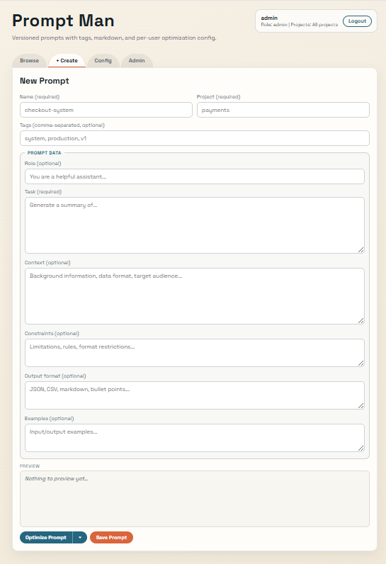
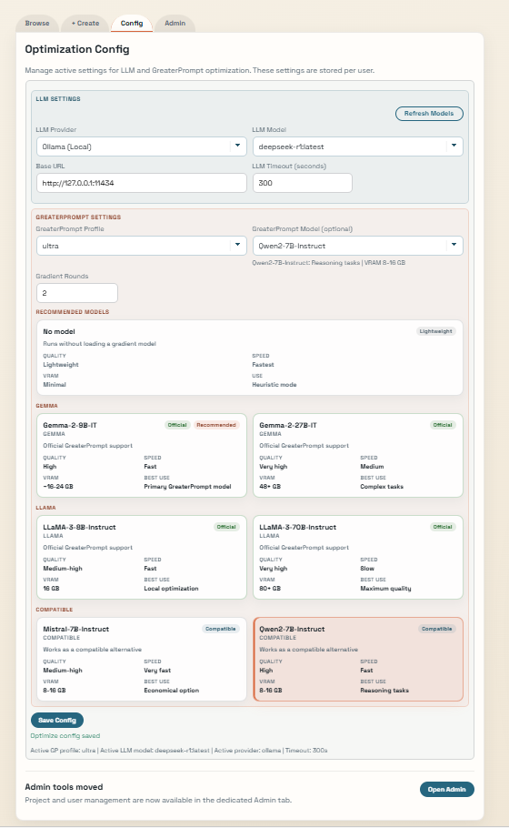
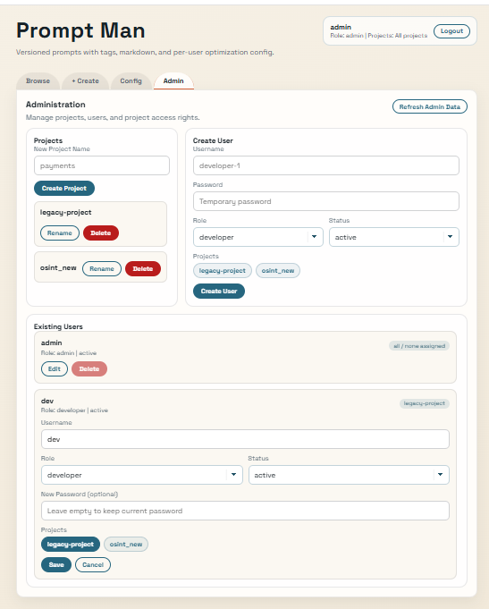
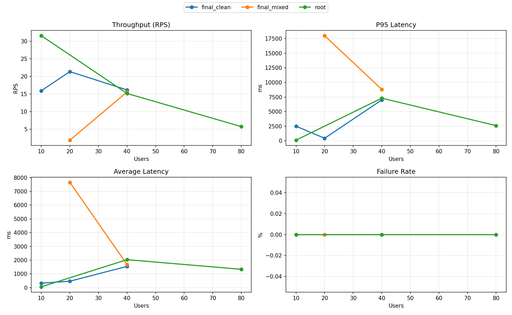
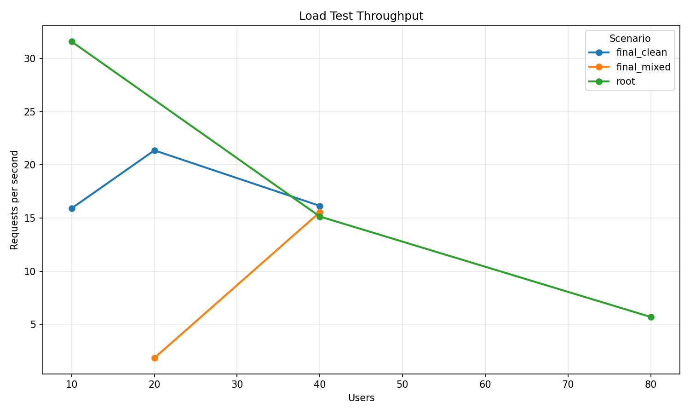
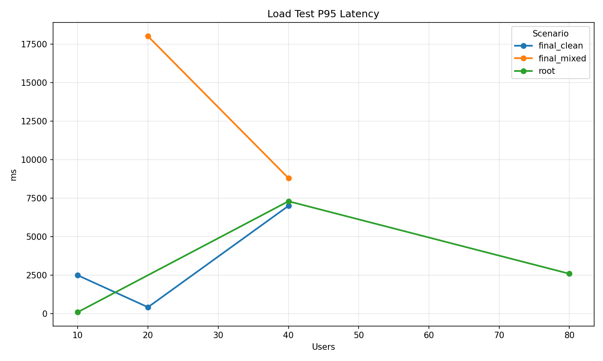
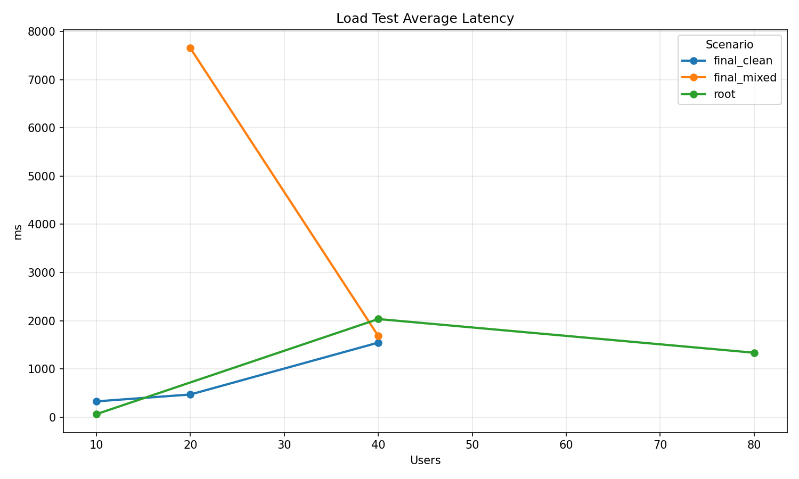
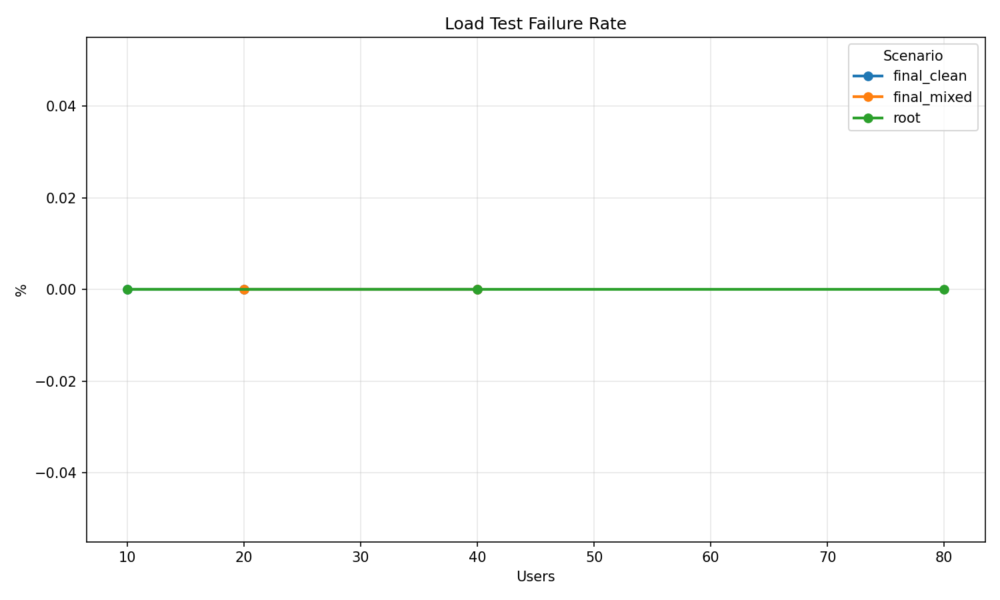

# Prompt Man

Prompt Man: FastAPI + Vue app for storing, versioning, and optimizing prompts.



## Program Snapshot






## Key Features

- Prompt storage by `project` + `name` with immutable version history.
- Structured prompt fields: `role`, `task`, `context`, `constraints`, `output_format`, `examples`.
- Tagging plus AND/OR search.
- Server-side prompt pagination with `X-Total-Count`.
- Prompt delete with cascading cleanup of versions and access data.
- Two optimization paths:
  - `Optimize Prompt` -> GreaterPrompt
  - `Optimize Prompt with LLM` -> provider-backed LLM flow
- GreaterPrompt profiles: `fast`, `quality`, `ultra`.
- Multi-provider LLM support: Ollama, OpenAI, Anthropic.
- Dynamic provider model discovery.
- Per-user optimization config persisted in the database.
- Authentication for REST API and UI.
- 30-minute access tokens with refresh-token based session renewal.
- RBAC with `admin`, `developer`, and `viewer` roles.
- Admin UI for project CRUD, user CRUD, and project access assignment.
- Normalized database schema with dedicated `projects` and `roles` tables.
- Prompt audit metadata: created/updated timestamps plus the user who made the change.
- Semantic Versioning (SemVer) with runtime version endpoint (`GET /version`).
- Sensitive config values encrypted at rest.
- Automatic database migration on startup.
- Default bootstrap admin support for first run.

## Versioning (SemVer)

This project uses Semantic Versioning: `MAJOR.MINOR.PATCH`.

- `PATCH`
  - backward-compatible bugfixes and internal fixes
- `MINOR`
  - backward-compatible new features or endpoints
- `MAJOR`
  - any backward-incompatible API/behavior change

Current application version is defined in [pyproject.toml](pyproject.toml) under `project.version`.
At runtime the app exposes version info via:

```text
GET /version
```

Example response:

```json
{
  "name": "prompt-man",
  "version": "0.1.0"
}
```

### Release Bump Checklist

1. Decide bump type (`PATCH` / `MINOR` / `MAJOR`).
2. Update `project.version` in [pyproject.toml](pyproject.toml).
3. Run tests.
4. Commit with release note (for example: `chore(release): 0.2.0`).
5. Create git tag matching version (for example: `v0.2.0`).

## Requirements

- Python 3.11+
- `uv` recommended, or plain `pip`

## Setup

### Using uv

```powershell
uv sync --extra dev
.\.venv\Scripts\Activate.ps1
alembic upgrade head
```

### Using pip

```powershell
python -m venv .venv
.\.venv\Scripts\Activate.ps1
pip install -r requirements.txt
alembic upgrade head
```

## Run

```powershell
uvicorn main:app --reload
```

On startup the app applies Alembic migrations automatically before serving requests.

- UI: http://127.0.0.1:8000
- API docs: http://127.0.0.1:8000/docs

## First Run And Authentication

The application is protected by authentication for both UI and API access.

- On a clean database, the login screen switches into bootstrap mode.
- The first admin can be created through `POST /auth/bootstrap-admin` or from the UI.
- Startup also ensures a default admin exists when the database is empty.
- Current default bootstrap credentials are `admin` / `admin`.

Authenticated users receive a bearer token and all protected API routes require it.

Session behavior:

- Access token lifetime is 30 minutes.
- Login/bootstrap returns both an access token and a refresh token.
- `POST /auth/refresh` issues a new token pair when the access token has expired but the refresh token is still valid.
- The UI refreshes the session automatically on `401` caused by an expired access token.
- The UI also schedules a proactive refresh 1-3 minutes before access token expiry.

## RBAC And Access Model

- `admin`
  - full access to all prompts and all projects
  - can manage users, roles view, projects, and project assignments
- `developer`
  - can only access prompts in explicitly assigned projects
  - has personal optimization config but no admin management access
- `viewer`
  - can read all prompts and personal config
  - cannot create, update, optimize, or delete anything

Roles are stored in a dedicated `roles` table. API responses still expose role names such as `admin` and `developer`.

## Database Model

The database is normalized internally while the external prompt API still works with project names.

- `projects`
  - reference table for project names
- `prompts.project_id`
  - foreign key to `projects.id`
- `project_access.project_id`
  - foreign key to `projects.id`
- `roles`
  - reference table for RBAC roles
- `users.role_id`
  - foreign key to `roles.id`
- `configs.user_id`
  - one-to-one per-user optimization config
- `prompts.created_at` / `prompts.updated_at`
  - prompt-level audit timestamps
- `prompts.created_by_id` / `prompts.updated_by_id`
  - prompt-level audit actor references
- `prompt_versions.created_at`
  - version creation timestamp
- `prompt_versions.created_by_id`
  - version author reference

Deleting a project cascades to related prompt and access rows.

## UI Overview

### Browse Tab

- View prompts by project/name.
- Filter by project and tag.
- Expand a prompt to inspect latest content and version history.
- See who created the prompt, who updated it last, and when those actions happened.
- All user-visible prompt audit timestamps are shown explicitly in UTC.
- Edit tags, create a new version, optimize, and delete prompts when the role has write access.
- Viewer sees the same data in read-only mode.

### Create Tab

- Create a prompt with required `name`, `project`, and `task`.
- Fill optional structured fields.
- Preview the composed prompt.
- Optimize before saving.

### Config Tab

- Manage personal optimization settings.
- Configure LLM provider, model, base URL, timeout, and token.
- Configure GreaterPrompt profile, model, and rounds.
- Save settings per user.
- Reuse the saved config in both optimize endpoints and model discovery.
- Viewer can inspect config values but cannot save changes.
- The session banner shows UTC expiry time, a live expiry countdown, and the next scheduled refresh time.

### Admin Tab

Visible for admins only.

- Project CRUD.
- User CRUD.
- Assign project access to users.
- View role and active/inactive state.
- Project and user lists are scrollable to keep the page compact.

Viewer does not have access to this tab.

### Optimization Modal

- Shows optimization engine, notes, execution log, and composed markdown.
- Supports `Reoptimize` without leaving the modal.
- Supports applying optimized content back into Create or Browse flows.

### Session Handling In UI

- The sign-in screen explains the 30-minute access-token lifetime.
- The app retries authenticated API requests once after refreshing the session.
- The app schedules refresh automatically 1-3 minutes before token expiry.
- The session banner displays both the remaining access-token lifetime and the next scheduled refresh countdown.
- Prompt cards and version history show audit metadata directly in the UI.

## Per-User Optimization Config

Each user has a separate optimization config row in `configs`.

- `GET /optimize/config` returns the current user's config.
- `PUT /optimize/config` updates the current user's config.
- `POST /optimize/greaterprompt` uses the current user's config.
- `POST /optimize/llm` uses the current user's config.
- `GET /optimize/providers/{provider}/models` uses the current user's config as the default override source.

One user's changes do not modify another user's config.

## Optimization Features

### GreaterPrompt

Endpoint:

```text
POST /optimize/greaterprompt
```

- Main UI optimize path.
- Uses gradient mode when a GreaterPrompt model is configured.
- Falls back to lightweight mode when gradient optimization is unavailable.

Profiles:

- `fast`
  - lowest cost / lowest latency
- `quality`
  - more candidates and filtering
- `ultra`
  - heaviest preset with more aggressive generation settings

### LLM Optimization

Endpoint:

```text
POST /optimize/llm
```

- Secondary optimize path in the split-button menu.
- Supports Ollama, OpenAI, and Anthropic.
- Uses strict JSON response parsing plus fallback cleanup/repair logic.

### Model Discovery

Endpoint:

```text
GET /optimize/providers/{provider}/models
```

- Ollama: discovered via provider API.
- OpenAI: discovered via provider API when a token is supplied.
- Anthropic: fixed built-in list.

## Optimization Config Example

```json
{
  "model_id": null,
  "rounds": 2,
  "gp_profile": "ultra",
  "llm_provider": "ollama",
  "llm_model": "qwen2.5:0.5b",
  "llm_base_url": "http://127.0.0.1:11434",
  "llm_timeout_seconds": 300,
  "llm_api_token": null
}
```

## Security Notes

- Password hashes are stored encrypted.
- LLM API tokens are stored encrypted.
- API responses never return plaintext token values.
- Tokens are decrypted only when needed for provider calls.
- Refresh tokens are signed and verified separately from access tokens.

## Environment Variables

- `DATABASE_URL`
  - default: `sqlite:///./prompts.db`
- `BOOTSTRAP_ADMIN_USERNAME`
  - optional first-run admin username override
- `BOOTSTRAP_ADMIN_PASSWORD`
  - optional first-run admin password override
- `PROMPTMAN_KEY`
  - optional machine/app key source for encryption
- `GREATERPROMPT_MODEL_ID`
  - fallback GreaterPrompt model when no per-user runtime override exists
- `GREATERPROMPT_ROUNDS`
  - fallback round count
- `GREATERPROMPT_PROFILE`
  - fallback profile: `fast`, `quality`, `ultra`
- `OPTIMIZE_LLM_PROVIDER`
  - fallback provider
- `OPTIMIZE_LLM_MODEL`
  - fallback model
- `OLLAMA_BASE_URL`
  - fallback base URL for local/default provider usage
- `OPTIMIZE_LLM_TIMEOUT_SECONDS`
  - fallback timeout
- `OPTIMIZE_LLM_API_TOKEN`
  - fallback encrypted token source

Per-user config returned by `/optimize/config` takes precedence over environment defaults for that user's optimize flows.

## API Surface

### Auth

- `POST /auth/bootstrap-admin`
- `POST /auth/login`
- `POST /auth/refresh`
- `GET /auth/status`
- `GET /auth/me`

`POST /auth/login`, `POST /auth/bootstrap-admin`, and `POST /auth/refresh` return:

- `access_token`
- `refresh_token`
- `access_token_ttl_seconds`
- `refresh_token_ttl_seconds`
- `access_token_expires_at`
- `refresh_token_expires_at`
- `user`

### Roles

- `GET /roles`

Admin-only read of available RBAC roles.

### Users

- `GET /users`
- `POST /users`
- `GET /users/{user_id}`
- `PUT /users/{user_id}`
- `PUT /users/{user_id}/projects`
- `DELETE /users/{user_id}`

### Projects

- `GET /projects`
- `GET /projects/{project_id}`
- `POST /projects`
- `PUT /projects/{project_id}`
- `DELETE /projects/{project_id}`

### Prompts

- `GET /prompts`
  - query params: `project`, `tag`, `limit`, `offset`
  - response header: `X-Total-Count`
  - each prompt includes `created_at`, `updated_at`, `created_by_username`, `updated_by_username`
- `GET /prompts/search`
  - query params: repeated `tags`, `mode`, optional `project`
- `POST /prompts`
- `GET /prompts/{project}/{name}`
- `PUT /prompts/{project}/{name}`
- `DELETE /prompts/{project}/{name}`
- `PUT /prompts/{project}/{name}/tags`
- `GET /prompts/{project}/{name}/versions`
- `GET /prompts/{project}/{name}/versions/{version}`

Each version response includes:

- `created_at`
- `created_by_username`
- prompt component fields

### Optimize

- `POST /optimize/greaterprompt`
- `POST /optimize/llm`
- `GET /optimize/config`
- `PUT /optimize/config`
- `GET /optimize/providers/{provider}/models`

## Prompt Uniqueness Rules

- Prompt identity is unique by `name + project_id` internally.
- Prompt versions enforce uniqueness for the full content tuple:
  - `role`, `task`, `context`, `constraints`, `output_format`, `examples`
- Duplicate version content returns `409 Conflict`.

## Notes For Operators

- The UI and API expose prompt projects by name for usability.
- The database stores project and role references by foreign key.
- If you inspect SQLite directly, expect `project_id` and `role_id` rather than string columns in normalized tables.

```text
GET /prompts?limit=10&offset=20
```

- `limit` and `offset` are optional.
- This allows API clients to either fetch the full collection or just a page/slice.

## Development

```powershell
ruff check .
ruff format .
mypy .
```

## Load Testing

This project includes repeatable load testing based on Locust and CSV-based chart generation.

### Run benchmark

```powershell
python loadtests/benchmark_rps.py --host http://127.0.0.1:8000 --duration 30s --users 10 20 40 --spawn-rate 10
```

### Build charts

```powershell
python loadtests/generate_charts.py
```

Charts are built from aggregated rows in `loadtests/results/**/u*_stats.csv` and written to `loadtests/`.

### Chart: Dashboard



Combined view for quick comparison across scenarios and user levels:
- Throughput (`RPS`)
- P95 latency
- Average latency
- Failure rate

### Chart: Throughput (RPS)



Shows how total request throughput changes as concurrent user count increases.
Use this graph to estimate sustainable request rate before latency degradation.

### Chart: P95 Latency



Shows tail latency behavior.
If this curve grows sharply, the service is near a bottleneck and user-facing response time becomes unstable.

### Chart: Average Latency



Shows general response-time trend under load.
Useful with P95 to distinguish overall slowdown from tail-only spikes.

### Chart: Failure Rate



Shows percentage of failed requests per run.
Combine this with latency and RPS to define production-ready capacity thresholds.

## Snippets

- Diagnostic one-off scripts are stored in `snippets/`.
- Current files:
  - `snippets/task_snippet.py` - runtime `/optimize/config` verification against running server.
  - `snippets/test_api.py` - local `TestClient` check for optimize config behavior.
  - `snippets/test_snippet.py` - direct helper-function check for non-string field normalization.

## Project Structure

```text
.
├── main.py
├── crud.py
├── models.py
├── schemas.py
├── optimizer_service.py
├── database.py
├── pyproject.toml
├── requirements.txt
├── snippets/
├── tests/
├── alembic/
└── ui/
```

## License

This project is licensed under the MIT License. See [LICENSE](LICENSE) for details.
